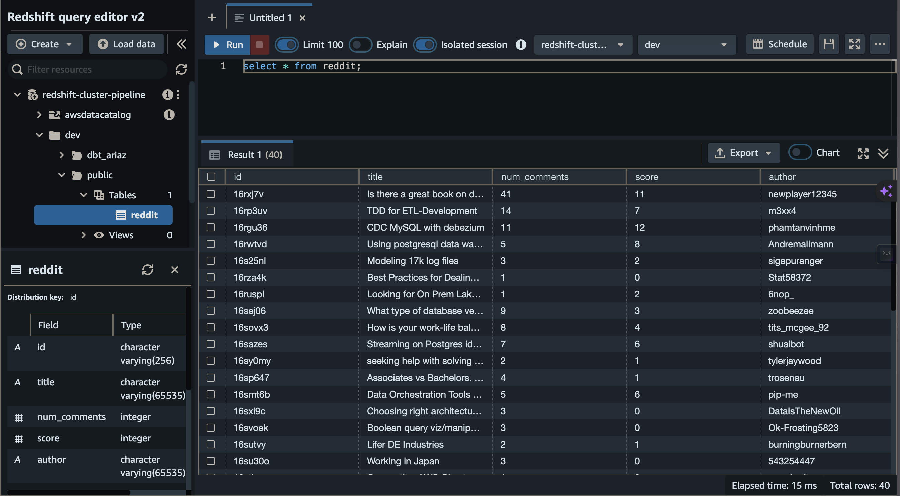

# Reddit Data Pipeline Project

Project was based on an interest in Data Engineering and the types of Q&A found on the official subreddit 'r/dataengineering'.

It also provided a good opportunity to develop skills and experience in a range of tools. As such, project is more complex than required, utilizing airflow, docker and cloud based storage.

## Architecture

## Terraform
The main cloud service provider used for this project is AWS. As such the infrasture has been provisioned through Terraform. The files used to provision the infrastructure are in the project files under the terraform folder.

## Docker & Airflow

Docker has been used to setup and use Airflow for setting up data pipeline. A docker-compose file that has been provided by airflow was used to provision an airflow instance.

The pipeline runs daily at midnight to extract the latest data and append it into table in data warehouse, i.e. Redshift.

The dags contain tasks that make API calls to Reddit in order to extract relevant data. The dag file that contains the dag is under dags folder called 'elt_reddit_pipeline.py'.

## Reddit API & S3 

Utilized PRAW (Python Reddit Api Wrapper) library which is a Reddit API wrapper that allows ease of use of Reddit's API's. The top posts from the dataengineering subreddit is extracted daily. The data is then converted into csv files and loaded into S3 bucket 'abdullahriaz-reddit-bucket'.

## Redshift

Copied the data from s3 bucket to redshift 'redshift-cluster-pipeline' data warehouse.

## Data Studio

The data is loaded Google Data Studio for data visualization purposes, depicting key insights.

The link to a live dashboard could be found in the following link: https://lookerstudio.google.com/reporting/116b4650-1355-463f-8435-fac91197eac8

The data pipeline has been paused for the purposes of preventing extra costs and using compute resources as the idea of this project was to get hands-on experience with data pipelines and its associated technologies. Therfore the data that is seen right now is static data. In actuality the data is to be updated every day after midnight using Airflow.
